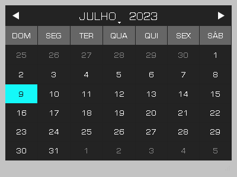

<h1 align="center">
    
    <p>CalendarWidgetPy</p>
</h1>

<div style="display:flex" align="center">
    
    
    
    
</div>


</br>

## About

Customized calendar app that offers a sleek and dark appearance. Pinned to the desktop, it provides quick access to important dates and features like holiday displays. Users can efficiently plan and manage appointments, making it an ideal choice for organization and date information.

## Features

* Customizable resizing
* Desktop fixation
* Free movement on the desktop
* Saves position and size
* Dynamic and static holidays relative to the Easter date
* 10-year calendar (past and future holidays)
* Sleek, dark, and transparent design
* Real-time marking with a 1-second interval wait time.

Note: This program was designed exclusively with Brazilian holidays in mind. Keep in mind that it does not include holidays from other countries or regions. You can customize the holidays according to your preferences by making modifications to the JSON file.

## Installation

1. Make sure you have Python installed on your machine. You can download the latest version of Python from [python.org](https://www.python.org).

2. Download or clone this GitHub repository to your local environment:
```bash
    #Clone the project
    git clone https://github.com/felipinodev/calendar-widget-py.git
```

3. Navigate to the project directory:
```bash
    #Enter directory
    cd calendar-widget-py
```

4. It is recommended to create a virtual environment to isolate the project dependencies. Run the following command to create and activate the virtual environment:
```bash
    # Create the virtual environment
    python -m venv myenv
    # Activate the virtual environment (Linux/Mac)
    source myenv/bin/activate
    # Activate the virtual environment (Windows) 
    myenv\Scripts\activate 
```

5. Install the dependencies using the `requirements.txt` file:
```bash
    #Install the dependencies
    pip install -r requirements.txt
```


### Running the Script

6. After completing the installation, you can run the `calendar-widget-py.py` script using the following command:

```bash
    #Running the Script
    python calendar-widget-py.py
```

## Release

We are continuously working on improving the **CalendarWidgetPy** project. Below are the released versions with their respective features and changes:

- [Version 1.0.0](https://github.com/felipinodev/calendar-widget-py/blob/master/releases/CalendarWidgetPy-1.0-x86-2023-Installer.zip) (2023-07-13):
  - Initial release of the calendar widget.
  - Basic functionality for displaying and navigating through dates.

Please refer to the [releases](https://github.com/felipinodev/calendar-widget-py/tree/master/releases) page for a complete list of all the released versions and their details.

## Attributions
This software was build using

* Python by [Python Software Foundation](https://www.python.org/)
    * Licensed under Python Software Foundation License

* Qt by [Qt Project](https://www.qt.io/)
    * Licensed under GPL 2.0, GPL 3.0 and LGPL 3.0

* python-dateutil by [Gustavo Niemeyer](https://pypi.org/project/python-dateutil/)
    * Licensed under Apache 2.0 License and BSD 3-Clause License
    
* six by <a href="https://pypi.org/project/six/">Benjamin Peterson</a>
    * Licensed under MIT License

## Python packages

* PyQt by [Riverbank Computing](https://riverbankcomputing.com/)
    * Licensed under Riverbank Commercial License and GPL v3

* python-dateutil by [Gustavo Niemeyer](https://dateutil.readthedocs.io/en/latest/)
    * Licensed under Apache 2.0 License and BSD 3-Clause License

* six by [Benjamin Peterson](https://six.readthedocs.io/)
    * Licensed under MIT License

# License
This software is licensed under the terms of the GNU General Public License version 3 (GPLv3). Full text of the license is available in the [LICENSE](https://github.com/felipinodev/calendar-widget-py/blob/master/LICENSE) file and [online](https://www.gnu.org/licenses/gpl-3.0.html).